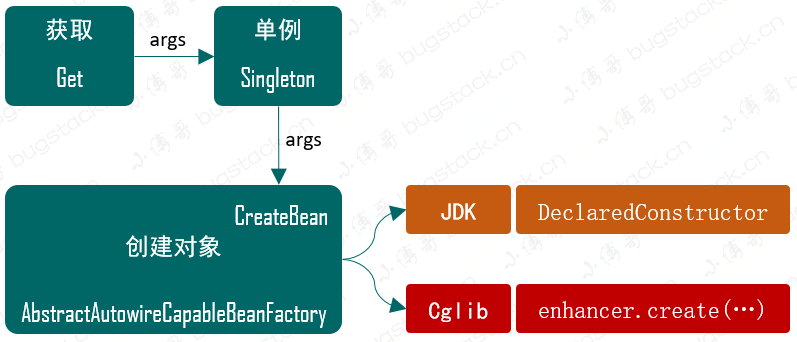

# 手写 Spring 框架

本项目是在学习教程《Spring 手撸专栏》的笔记记录。教程原文链接如下：

[《Spring 手撸专栏》](https://mp.weixin.qq.com/s?__biz=MzIxMDAwMDAxMw==&mid=2650730541&idx=1&sn=9fcd5baf6ec3e880786c4a0384166bdd&chksm=8f6111cfb81698d9bb5a4c61075d87658f7296bdb42ea72dd1b7d4312f3b75f719399ed2223c&cur_album_id=1871634116341743621&scene=189#wechat_redirect)

## Bean 容器
Bean 容器就是 Spring 框架中管理所有对象的容器，因为在 Spring 框架中使用 IOC（控制反转）技术来创建和管理所有的对象，所以需要一个容器来管理这些对象。

Bean 容器主要有两个类实现：BeanDefinition 和 BeanFactory。

* BeanDefinition：用来定义对象
* BeanFactory：使用 HashMap 来管理 BeanDefinition

### 完善 Bean 容器的设计
上面完成了一个基本的 Bean 容器，现在我们需要运用设计模式来完善 Bean 容器，使其具有单例模式的能力，职责分离，便于后期的管理：

整体的设计如下：

容器中的各个类关系如下：

* 首先改造了 BeanDefinitioin，原先存放的是已经实例化后的对象，现在改为 Class 类，这样就不要用户手动实例化对象，而是把对象的创建权交给容器
* 通过 SingletonBeanRegistry 接口和 DefaultSingletonBeanRegistry 实现类，我们实现了单例模式的能力
* 通过 BeanFactory 和 BeanDefinitionRegistry 这两个接口，规定了 Bean 的获取和注册的方式
* 通过 AbstractBeanFactory 抽象类确定了获取 Bean 的实现逻辑
* AbstractAutowireCapableBeanFactory 抽象类实现了 Bean 的新建逻辑
* DefaultListableBeanFactory 类则是最终的一个 BeanFactory 实现类，用于实际使用

最终通过上述的这种接口、抽象类的方式，使各个类各司其职，职责分离，方便后续的代码维护

### 对象实例化
上面只做了简单的空参情况的对象实例化，现在需要考虑有参数的对象实例化。有两种方式的有参对象实例化：

1. 通过 JDK 方式，也就是 Java 自带的方式进行对象实例化（反射）
2. 通过 Cglib: Cglib 的方式是通过创建一个目标对象的子对象来实现的

### 对象属性填充
在上述创建完对象后，接下来就需要去填充对象中的属性了，对象中的属性有基本类型，也有依赖于其他的 Bean 对象，所以这里也会存在循环依赖的问题。不过关于循环依赖，这里先不展开。

* 这里我们使用 PropertyValue 和 PropertyValue 这两个类来管理对象的属性。
* 在 createBean 中创建完 Bean 对象后，再调用 applyPropertyValues 来填充 Bean 的属性。
* 我们通过 BeanReference 来表示 Bean 类型的属性。如果待创建的 Bean 中包含其他 Bean 对象，则会先递归创建其他 Bean 对象。

类关系图如下：

### 实现从 XML 加载 Bean 对象
之前都是从测试类中手动进行 Bean 对象的注册和定义，现在我们需要实现从配置文件中自动注册加载 Bean 对象。加载过程如下：

为了实现资源加载功能，这里定义两种类：资源类，Bean 加载类。

* 资源类：用来表示不同的资源方式，目前有 Class 类方式、File 文件方式还有 Http 方式这三种，因此需要一个类来定义资源的标准。
* Bean 加载类：实现从资源中加载 Bean 的功能

具体的类关系如下：

## 实现上下文和扩展机制
在上面的实现中，我们暴露了 BeanFactory 和 BeanDefinitionReader 来实现 Bean 的创建和注册。这种方式使用起来比较繁琐，同时我们后面还需要增加 Bean 创建前后的钩子处理函数，因此我们提供一个封装了注册、创建、钩子函数等所有功能的统一的类：上下文类。

通过下面两个接口实现了对象创建过程中的钩子函数：
* BeanFactoryPostProcess: 是由 Spring 框架组建提供的容器扩展机制，允许在 Bean 对象注册后但未实例化之前，对 Bean 的定义信息 BeanDefinition 执行修改操作。
* BeanPostProcessor: 也是 Spring 提供的扩展机制，不过 BeanPostProcessor 是在 Bean 对象实例化之后修改 Bean 对象，也可以替换 Bean 对象。这部分与后面要实现的 AOP 有着密切的关系。

* 以继承了 ListableBeanFactory 接口的 ApplicationContext 接口开始，扩展出一系列应用上下文的抽象实现类，并最终完成 ClassPathXmlApplicationContext 类的实现。而这个类就是最后交给用户使用的类。
* 同时在实现应用上下文的过程中，通过定义接口：BeanFactoryPostProcessor、BeanPostProcessor 两个接口，把关于对 Bean 的扩展机制串联进去了。
* 在上下文类中，会先找到所有实现了 BeanFactoryPostProcessor、BeanPostProcessor 的类，并在对应的生命周期中调用。

### Bean 对象创建和销毁的钩子
这里我们使用两种方式来实现对象创建和销毁的钩子：
1. 通过接口定义的方式来实现：提供了 InitializingBean 和 DisposableBean 这两个接口来定义对象的创建和销毁的钩子函数，在对应的生命周期中，通过判断当前 bean 对象是否实现了这两个接口来实现调用（直接使用 instanceof 来进行判断, 并强制转换后直接调用）
2. 通过 xml 中配置来实现：在 BeanDefinition 中增加 init-method 和 destroy-method 属性来定义对象的创建和销毁的钩子函数，并通过反射的方式进行调用
3. 添加了 DisposableBeanAdapter 类来统一两种形式的销毁钩子

类关系图如下：

