# 手写 Spring 框架

本项目是根据教程 [Spring 手撸专栏](https://mp.weixin.qq.com/s?__biz=MzIxMDAwMDAxMw==&mid=2650730541&idx=1&sn=9fcd5baf6ec3e880786c4a0384166bdd&chksm=8f6111cfb81698d9bb5a4c61075d87658f7296bdb42ea72dd1b7d4312f3b75f719399ed2223c&cur_album_id=1871634116341743621&scene=189#wechat_redirect) 自己手动实践一遍，旨在加深对教程的理解

## 1. Bean 容器

相信用过 Spring 框架开发的小伙伴都知道 IOC，DI 等这些概念，而这些概念都离不开容器。所谓的容器本质就是能保存数据的地方。本章就从容器的实现开始

上文说到容器本质就是存放并管理数据的地方，而为了能更好的实现，我们首先需要一个对数据的统一定义，方便后续的操作，然后就需要一个管理数据的接口，方便数据的添加和获取，很明显，HashMap 就很好的满足这个要求。为此我们添加下面两个对象来实现数据的定义和管理：

* BeanDefinition：用来定义对象。这里使用 BeanDefinition 将对象再包装一层，方便后续的统一操作
* BeanFactory：管理对象。内部使用 HashMap 来管理添加和获取对象

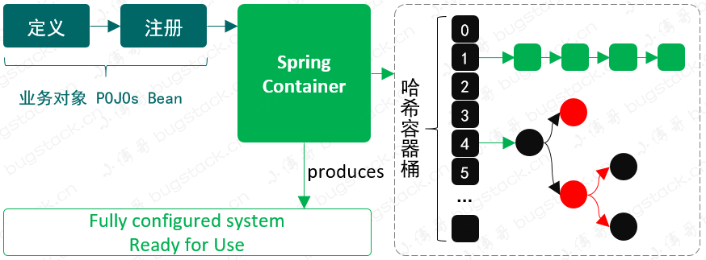

## 2. 完善 Bean 容器
在上一章我们完成了一个基本的 Bean 管理容器，现在我们需要进一步优化

* 首先就是对象的实例化操作应该由容器来实现，而不是在注册的时候手动实例化对象。所以需要改造 *BeanDefinition*，用来存储 Class，而不是实例化的对象
* 其次，我们需要扩展容器的能力，比如添加单例能力，这样在多次获取对象的时候，不至于重复创建对象，浪费性能。为了实现单例能力，我们定义了标准接口 *SingletonBeanRegistry*，以及它的实现类 *DefaultSingletonBeanRegistry*
* 然后我们定义了一个标准的接口 *BeanFactory* 用来定义 Bean 操作的核心标准
* 再然后我们添加一个抽象类 *AbstractBeanFactory* 实现了这个标准接口 *BeanFactory*，同时该类继承了上述的单例实现类 *DefaultSingletonBeanRegistry*，并最终用单例的方式实现了 getBean 方法。同时 getBean 方法的实现又依赖于 getBeanDefinition 和 createBean 这两个方法，等待后续子类继承实现
* 接着我们再定义 *AbstractAutowireCapableBeanFactory* 类并继承自上述的 *AbstractBeanFactory*，该类专门实现 createBean 的方法，通过类的 newInstance 方式来创建实例对象。不过该方法存在一些问题，下面章节会重点优化 
* 最后我们定义了最终的核心实现类 *DefaultListableBeanFactory*，它继承自上述的 *AbstractAutowireCapableBeanFactory* 类，同时为了管理 BeanDefinition，又实现了接口 *BeanDefinitionRegistry*，最终实现了 getBeanDefinition 方法

我们通过上述的接口定义、类继承等方式，实现了单例能力，并且通过清晰的指责划分，将 bean 的获取、创建、注册等严格区分开，方便后续管理和扩展

整体的设计如下：

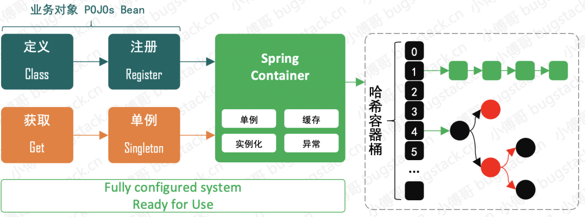

容器中的各个类关系如下：

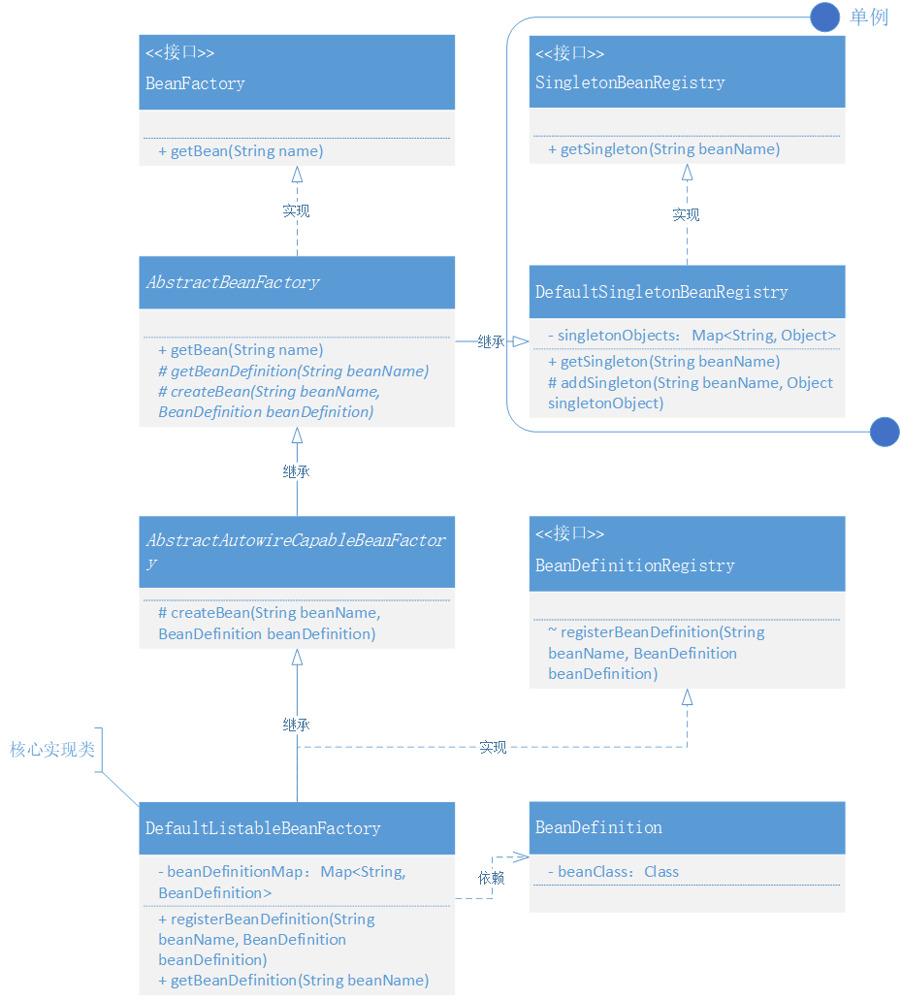

## 3. 对象实例化的优化
在上一章中，我们对对象的实例化只做了简单的处理，只能满足无参情况的实例化。这一章中补上有参的实例化功能。目前我们有以下两种方式进行对象的实例化：

1. JDK 方式：基于反射技术，是 Java 自带的
2. Cglib 方式：基于字节码技术，并且在实例化的时候是创建一个目标对象的子对象来实现的

为了方便这两种实例化方式的管理，这里我们使用策略模式来实现。首先定义一个标准的实例化策略接口 *InstantiationStrategy*，其中包含 instantiate 方法

然后基于这个标准接口，我们添加了两个基本的实例化实现类：*SimpleInstantiationStrategy*, *CglibSubclassingInstantiationStrategy*，分别代表 JDK 方式实例化对象和 Cglib 方式实例化对象

同时我们在 BeanFactory 接口中增加了一个带构造参数的 getBean 方法，并修改类 *AbstractAutowireCapableBeanFactory* 类中的 createBean 中的实现方法，根据参数数量来获取对应的构造函数后，再调用前面的实例化方式进行创建对象

整体结构如下：


对象修改如下：
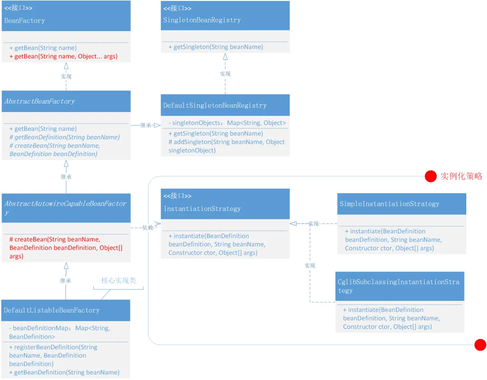

## 4. 对象属性填充
我们现在已经完成了对象实例化的创建，但一个对象内部还有很多的属性，因此这一章我们来实现对象属性的添加。

* 首先对象属性的添加时机肯定是在对象创建完成后，所以我们在类 *AbstractAutowireCapableBeanFactory* 的 createBean 方法中，在实例化对象后，添加方法 applyPropertyValues 来给对象进步一添加属性
* 其次就是属性的表达，我们这里定义类 *PropertyValue* 用来表示属性，它包含 name 和 value 这两个值
* 一般对象都会有多个属性，所以我们又定义类 *PropertyValues*，用来管理属性，包含添加、获取属性列表、获取指定属性等方法，用来管理我们的属性
* 同时，对象的属性不仅包含 int, boolean 等基础数据，也包含 Object，Bean 等其他对象，而为了表示其他 Bean 对象（对象 A 里面包含了对象 B），我们这里使用类 *BeanReference* 来表示其他对象属性
* 然后我们修改 BeanDefinition，添加 propertyValues 属性来表示 Bean 中的所有属性
* 最后在添加对象属性的时候，我们使用 hutool-all 工具中的 BeanUtil 来添加属性值。对于 BeanReference 类型的属性添加，我们需要先去获取 Bean，然后在添加，对于其他类型的属性，则可以直接添加
* 对象之间的循环依赖问题这里暂不处理

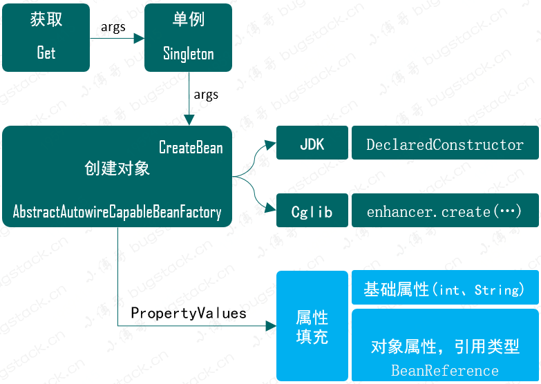

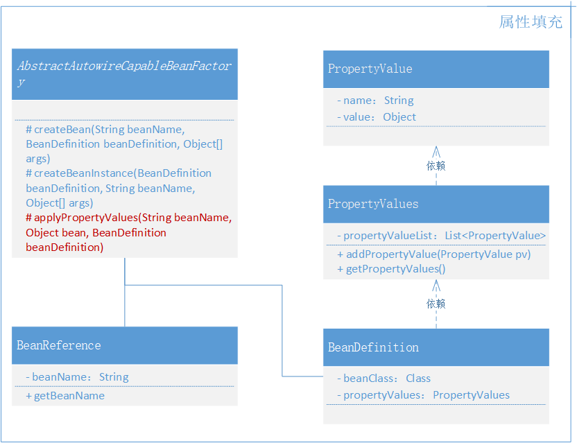

## 5. 实现从 XML 加载 Bean 对象
上一章我们已经实现了对象属性的添加，现在还有一个问题就是对象的注册，属性的添加等都是我们手动操作的，所以这章节我们实现从配置文件中自动注册加载 Bean 对象。加载过程如下：从不同类型的资源中解析并注册添加 Bean 对象到容器中

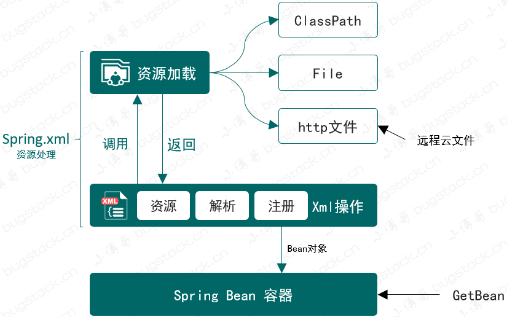

为了实现上述的能力，我们需要实现下述内容：

* 首先我们需要定义一个表示资源的接口 *Resource*，其中的 getInputStream 方法就是输出资源内容的接口
* 接下来我们就可以基于这个标准接口定义三个类: *ClassPathResource*, *FileSystemResource*, *UrlResource* 分表表示类路径、文件和 url 这 3 种资源
* 现在我们有了上述的用来表示资源的类以后，接下来我们需要实现一个资源加载的类，用来统一包装实现上述这 3 个不同资源的加载。为此我们定义标准接口 *ResourceLoader*，以及其实现类: *DefaultResourceLoader*，资源统一加载的实现逻辑如下：
  * 先判断路径是否是 "classpath:" 前缀的，如果是，则直接返回 ClassPathResource 资源
  * 如果不是"classpath:" 前缀，则尝试 URL 连接并返回 UrlResource 资源
  * 如果上述步骤报错，则返回最后一种 FileSystemResource 资源
* 在实现了上述的资源加载类以后，接下来就是资源的解析、Bean 对象注册添加的实现了。为此我们还是先定义标准接口 *BeanDefinitionReader*，其核心方法是 loadBeanDefinitions，但该方法的实现也同时依赖于另外两个非核心方法: getRegistry 和 getResourceLoader
* 我们定义一个抽象类 *AbstractBeanDefinitionReader* 用来实现上述接口的非核心方法
* 然后我们就可以定义核心实现类 *XmlBeanDefinitionReader*，实现其核心方法 loadBeanDefinitions，实现逻辑如下：
  * 以 XML 的形式去解析资源，并循环遍历其中的节点
  * 找出其中以 bean 为命名的节点，解析标签，获取各种属性后，生成 BeanDefinition 对象
  * 继续遍历上述节点的子节点，找出其属性节点后进行属性的添加
  * 最后完成 BeanDefinition 的注册，需要注意对重复注册的判断
* 最后，我们需要将上述的 BeanDefinitionReader 和 BeanFactory 两者关联起来就可以了。这里我们是通过将 DefaultListableBeanFactory 作为 BeanDefinitionReader 的一个属性来进行关联  
  
在上述的资源解析实现过程中，我们先定义了标准接口，然后定义了一个抽象类用来实现标准接口中的非核心方法，最后再定义核心实现类用来实现核心逻辑，这种接口管定义，抽象类管其他实现，最终实现类管核心实现逻辑的设计方式是我们日常用到的，可以有效的避免无关方法污染最终实现类

以上这些接口、类的关系如下：


## 6. 实现上下文和扩展机制
在上一章的实现中，我们通过 BeanFactory 和 BeanDefinitionReader 来实现 Bean 的创建和注册，但这种方式使用起来比较繁琐，不适合面向用户。因此在这章中我们通过实现一个上下文类来结合这两者，对外提供一个完整的服务

同时我们还提供了扩展机制，如下：
* BeanFactoryPostProcessor：是由 Spring 框架组建提供的容器扩展机制，允许在 Bean 对象注册后但未实例化之前，对 Bean 的定义信息 BeanDefinition 执行修改操作。
* BeanPostProcessor：也是 Spring 提供的扩展机制，不过 BeanPostProcessor 是在 Bean 对象实例化之后修改 Bean 对象，也可以替换 Bean 对象。这部分与后面要实现的 AOP 有着密切的关系。

整体的结构设计如下：在应用上下文类中通过 refresh 方法自动实现 Bean 加载、注册和实例化；同时在 createBean 的前后提供钩子函数，方便修改 Bean 对象

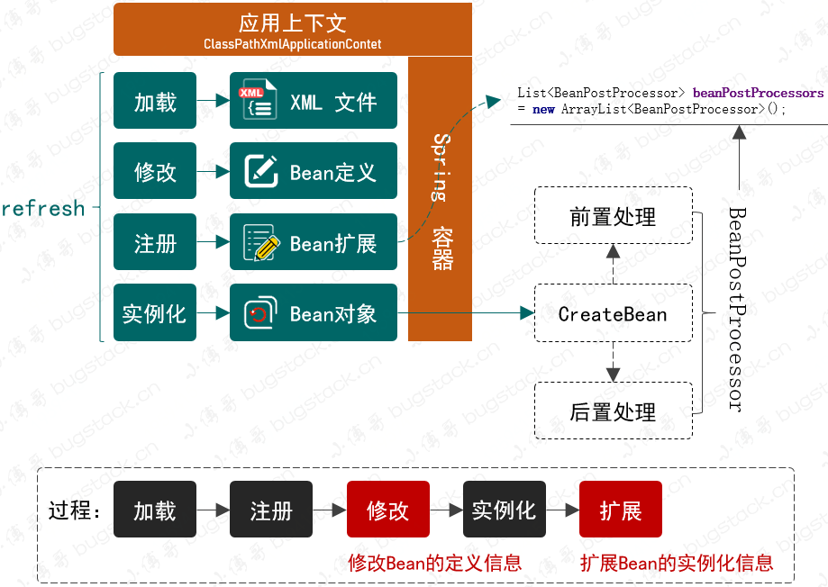

### BeanFactory 相关接口的改动
在具体开始前，我们先对原先的一些接口做改动和扩充，具体如下：
* BeanFactory: 已经存在的 Bean 工厂接口用于获取 Bean 对象，这次新增加了按照类型获取 Bean 的方法：<T> T getBean(String name, Class<T> requiredType)
* ListableBeanFactory: 是一个扩展 Bean 工厂接口的接口，新增加了 getBeansOfType、getBeanDefinitionNames() 方法，在 Spring 源码中还有其他扩展方法
* HierarchicalBeanFactory: 在 Spring 源码中它提供了可以获取父类 BeanFactory 方法，属于是一种扩展工厂的层次子接口
* AutowireCapableBeanFactory: 是一个自动化处理 Bean 工厂配置的接口
* ConfigurableBeanFactory: 可获取 BeanPostProcessor、BeanClassLoader等的一个配置化接口。
* ConfigurableListableBeanFactory: 提供分析和修改Bean以及预先实例化的操作接口，不过目前只有一个 getBeanDefinition 方法。

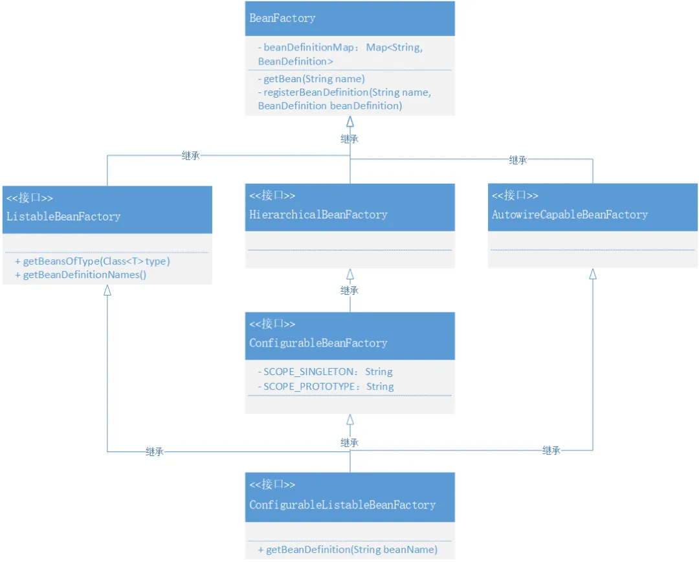

### 应用上下文类的实现
* 首先我们定义一个最基本的上下文类接口 *ApplicationContext*，它继承自 *ListableBeanFactory*，意味着这个上下文接口就有用了 BeanFactory 的能力
* 然后我们在上面的 *ApplicationContext* 的基础上定义接口 *ConfigurableApplicationContext*，用来定义刷新容器方法 refresh
* 接着我们定义抽象实现类 *AbstractApplicationContext*，它继承了 DefaultResourceLoader 类，拥有了资源加载能力，同时它还实现上述接口中的 refresh 方法，实现逻辑主要包含以下几步：
  * 创建 BeanFactory，并加载 BeanDefinition
  * 获取 BeanFactory
  * 执行 BeanFactory 创建后的钩子函数 BeanFactoryPostProcessor
  * 注册 Bean 对象实例化前后的钩子函数 BeanPostProcessor，方便后续 Bean 实例化时调用
  * 提前实例化单例Bean对象
* 接着我们定义抽象实现类 *AbstractRefreshableApplicationContext*，用来实现 BeanFactory 的创建和加载方法，这里主要是将抽象类 *DefaultListableBeanFactory* 作为内部属性来实现
* 然后我们定义抽象实现类 *AbstractXmlApplicationContext*，用来实现 BeanDefinition 的加载
* 最后我们定义最终的上下文实现类 *ClassPathXmlApplicationContext*

### 扩展机制的实现
* 我们定义接口 *BeanFactoryPostProcessor* 用来表示 BeanFactory 创建后的扩展，定义接口 *BeanPostProcessor* 来表示 Bean 实例化前后的钩子函数
* BeanFactoryPostProcessor 钩子函数在上述 refresh 中就已经调用了，具体的调用方式很简单，就是直接获取该类型的对象，然后直接调用方法即可
* BeanPostProcessor 在 refresh 函数中会先进行添加，添加的逻辑实现在 AbstractBeanFactory 类中，然后再后续 Bean 对象实例化时再进行调用
* 我们定义接口 *AutowireCapableBeanFactory*，用来定义 Bean 实例化前后的两个钩子方法
* 我们定义接口 *ConfigurableBeanFactory*，用来定义添加钩子函数的方法，并且在抽象类 *AbstractBeanFactory* 中实现添加钩子函数的方法
* 最后我们定义抽象类 *AbstractAutowireCapableBeanFactory*，该抽象类继承 *AbstractBeanFactory*，所以拥有了钩子函数的添加能力，然后也实现了接口 *AutowireCapableBeanFactory*，实现了钩子函数的调用方法，该钩子函数的调用方法也很简单，就是就是直接循环调用注册那些钩子函数即可，而具体的钩子函数的注册在 refresh 中就已经完成

至此我们就完成了扩展机制的实现，这里再简单总结一下:

* 对于 BeanFactoryPostProcessor 钩子函数，我们直接在 refresh 中调用实现，对于 BeanPostProcessor 钩子函数，我们先在 refresh 中注册添加，然后在 *AbstractAutowireCapableBeanFactory* 抽象类中，在实例化 Bean 的时候进行调用
* 同时为了设计实现，我们将钩子的注册添加通过接口 *ConfigurableBeanFactory* 来定义，并由抽象类 *AbstractBeanFactory* 实现
* 钩子函数的调用实现通过接口 *AutowireCapableBeanFactory* 来定义
* 最后抽象类 *AbstractAutowireCapableBeanFactory* 继承 *AbstractBeanFactory*，并且实现 *AutowireCapableBeanFactory* 接口，完成钩子的注册添加以及实现调用的完整流程

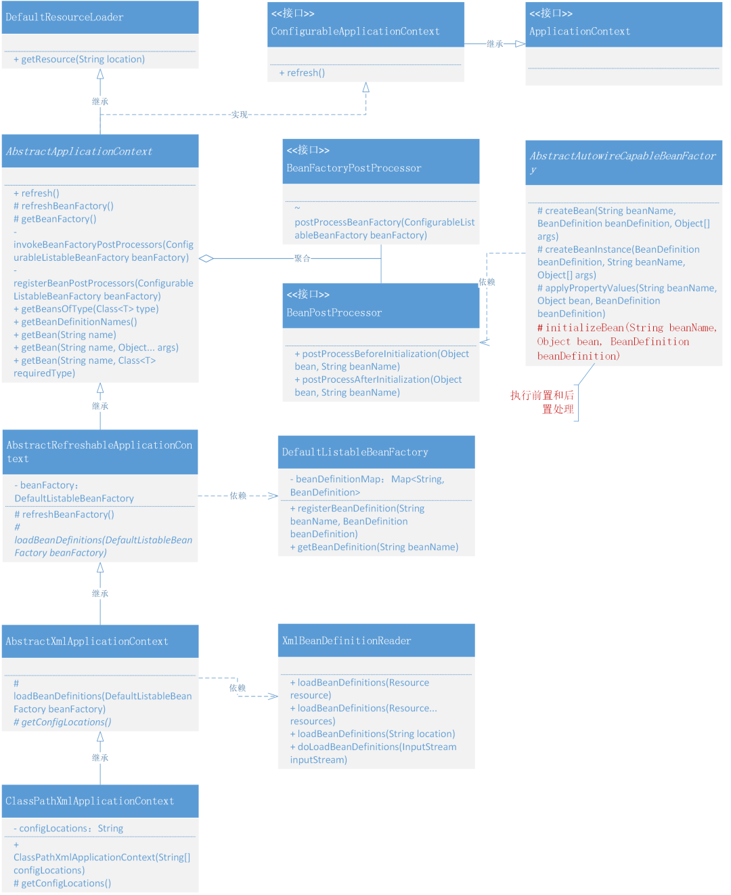

## 7. Bean 对象创建和销毁的钩子
在上一章中我们实现了扩展机制，在 Bean 对象创建前后增加了钩子函数，这一章我们继续添加钩子函数，具体是对象初始化和销毁的钩子函数。这两个钩子函数的添加有两种方式：
1. 通过属性的方式添加，具体就是在 BeanDefinition 中添加两个属性表示初始化和销毁的函数
2. 通过标准接口的方式添加

* 对于第一种方式的实现，我们需要在 BeanDefinition 中添加两个属性表示初始化和销毁的函数，然后在 xml 文件中配置这两个函数名称，最终通过反射的方式调用这两个方法
* 对于第二种方式的实现比较简单，我们直接判断当前 Bean 是否是定义的标准接口，如果是则直接在 bean 上进行调用方法即可
* 同时为了能更方便的执行销毁，我们再封装一个适配类 *DisposableBeanAdapter* 来统一实现这两种不同方式的销毁钩子

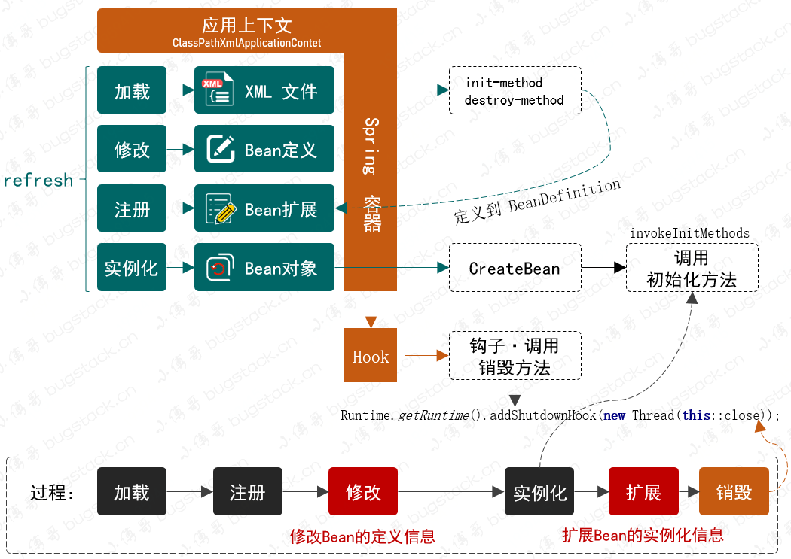

类关系图如下：

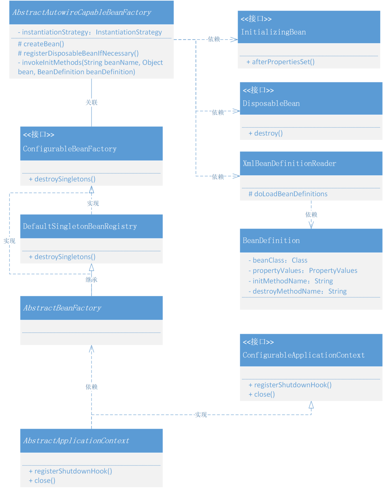

### 具体实现
* 首先我们在 *BeanDefinition* 中添加两个属性，表示初始化和销毁，同时要在类 *XmlBeanDefinitionReader* 中解析 BeanDefinition 时添加这两个属性
  * initMethodName
  * destroyMethodName
* 然后我们定义下面两个标准接口，用来表示第二种方式的钩子函数
  * InitializingBean
  * DisposableBean
* 然后我们在抽象类 *AbstractAutowireCapableBeanFactory* 中进行初始化钩子函数的调用，因为该类是实现 Bean 实例化，所以我们在该类中实现初始函数的钩子调用，具体调用逻辑很简单：
  * 当前的 Bean 是否实现了接口 *InitializingBean*，如果是则直接调用初始化方法
  * 当前 BeanDefinition 中是否有初始化钩子方法属性，如果有则通过反射调用此方法
* 调用完初始化钩子方法后，接下来我们注册添加销毁钩子，因为对象的销毁涉及到单例对象，所以我们把注册添加的实现我们放在单例类中 *DefaultSingletonBeanRegistry*，方法为 registerDisposableBean，同时在单例接口中添加了销毁方法的定义 destroySingletons，并由实现类实现
* 为了统一销毁钩子的调用，我们这里添加统一包装类 *DisposableBeanAdapter*，具体的销毁逻辑和上述的初始化调用逻辑类似，不过有个额外的逻辑就是判断下通过属性的销毁函数和接口中的销毁函数是否一致，避免重复调用销毁函数
* 销毁钩子的调用时机是在程序退出前，因为我们在 *ConfigurableApplicationContext* 中定义注册方法 registerShutdownHook，表示在程序退出前调用的钩子
* 最后在抽象类 *AbstractApplicationContext* 中实现上述的注册方法，并在注册方法的实现中调用 destroySingletons 方法来完成对象销毁钩子

## 8. 定义标记类对象，实现容器感知
目前为止我们已经有了一个功能很强大的框架了，有上下文，有钩子等能力，但如何将这些强大的内部能力对外开放呢，换句话说如果让外面的对象能感知到容器内部的能力呢，这就是本章节需要解决的问题

解决的思路其实很简单，就是我们定义标准的感知接口，然后由外部对象实现该感知接口，然后在容器创建 Bean 对象时，判断是否实现了感知接口，如果实现则直接调用接口方法将容器内的 BeanFactory 等开放给外部用户即可。而判断的方法也很简单，就是像之前那样，通过 instanceof 方式来判断即可

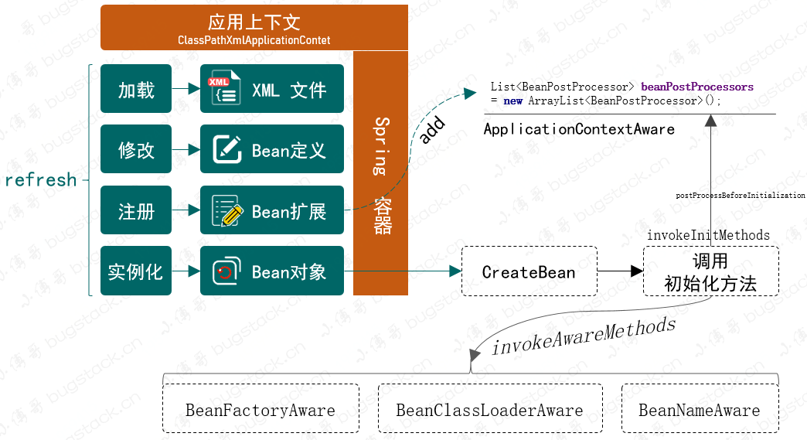

### 具体实现
* 首先我们定义标准的感知接口 *Aware*，然后基于该接口我们扩展下面 4 个具体的感觉接口。需要注意的是前 3 个感知接口都和 Bean 相关，所以直接在 createBean 方法中处理即可，而第 4 个是上下文相关，在 createBean 中获取不到，因此需要借助 BeanPostProcessor 扩展来实现
  * BeanFactoryAware：感知所属的 BeanFactory
  * BeanClassLoaderAware：感知所属的 ClassLoader
  * BeanNameAware：感知所属的 BeanName
  * ApplicationContextAware：感知所属的 ApplicationContext
* 然后我们定义一个实现 *BeanPostProcessor* 接口的包装类 *ApplicationContextAwareProcessor*，用来实现 ApplicationContext 的感知，关于 BeanPostProcessor 的注册添加调用等功能在之前已经实现过了，这里不再赘述
* 接着我们在抽象类 *AbstractApplicationContext* 中的 refresh 方法中添加上述的 ApplicationContextAwareProcessor 扩展，将当前的 ApplicationContext 添加进去
* 最后我们在抽象类 *AbstractAutowireCapableBeanFactory* 中的 initializeBean 方法中实现感知，通过 instanceof 来判断当前的 bean 是否实现了对应的感知接口即可

类关系如下：
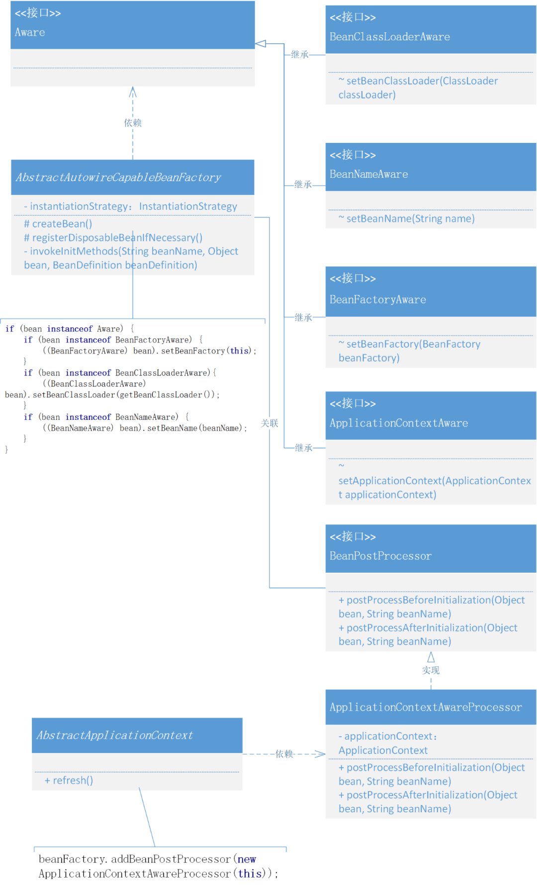

## 9. Bean 对象作用域的实现已经动态代理对象的注册
之前创建的 Bean 对象默认都是单例的，在本章节中我们实现对象的原型作用域，在每次使用的时候都会重新创建对象。 同时之前容器中只会添加简单的对象，现在我们增强容器的能力，支持添加那些复杂的并以代理方式动态变化的对象，以下简称复杂类

为啥要添加复杂类的对象呢？是因为有了这种复杂类后，我们就可以像 Spring 中的 MyBatis 那样，不需要手动的去创建任何操作数据库的 Bean 对象，只需要一个接口定义，就可以被注入到其他需要使用 Dao 的属性中去，从而极大的方便使用

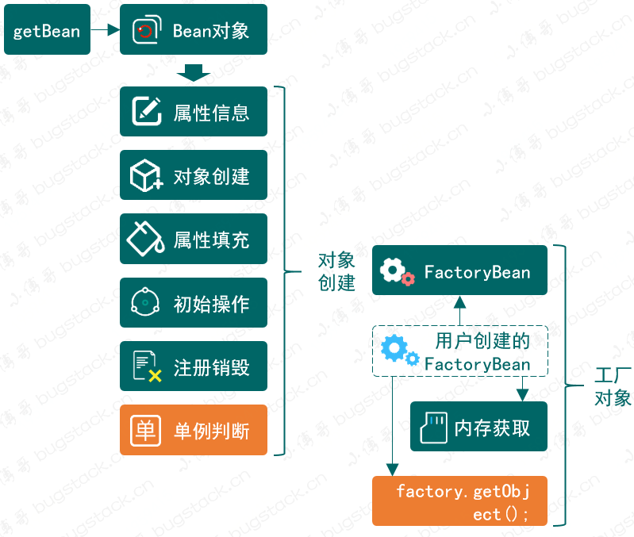

### 具体实现
* 首先是作用域的实现，这个比较简单，我们在 *BeanDefinition* 中添加 scope 属性，用来表示 Bean 对象的作用域，然后在 xml 解析的时候添加这个属性
* 接着在 createBean 的时候，根据 scope 来决定当前 Bean 对象是否放到容器中作为单例对象，还是不放在容器中。同时在注册销毁钩子的时候，需要增加判断：非单例对象不需要添加销毁钩子
* 然后就是对于复杂对象的实现。这里我们为了不污染原先简单对象的创建，我们单独实现一个基于 *DefaultSingletonRegistry* 的抽象类，在该抽象类 *FactoryBeanRegistrySupport* 中实现了复杂对象的存取，同时也考虑了作用域
* 然后我们修改 *AbstractBeanFactory* 类的父类，从原先的 *DefaultSingletonRegistry* 改为 *FactoryBeanRegistrySupport*，然后修改下 doGetBean 方法的逻辑，这样最后我们的框架也就有了复杂对象的存取能力
* 然后我们定义标准接口 *FactoryBean* 用来表示任何实现该接口的对象都是复杂对象，都通过 getObject 方法来获取最终的对象

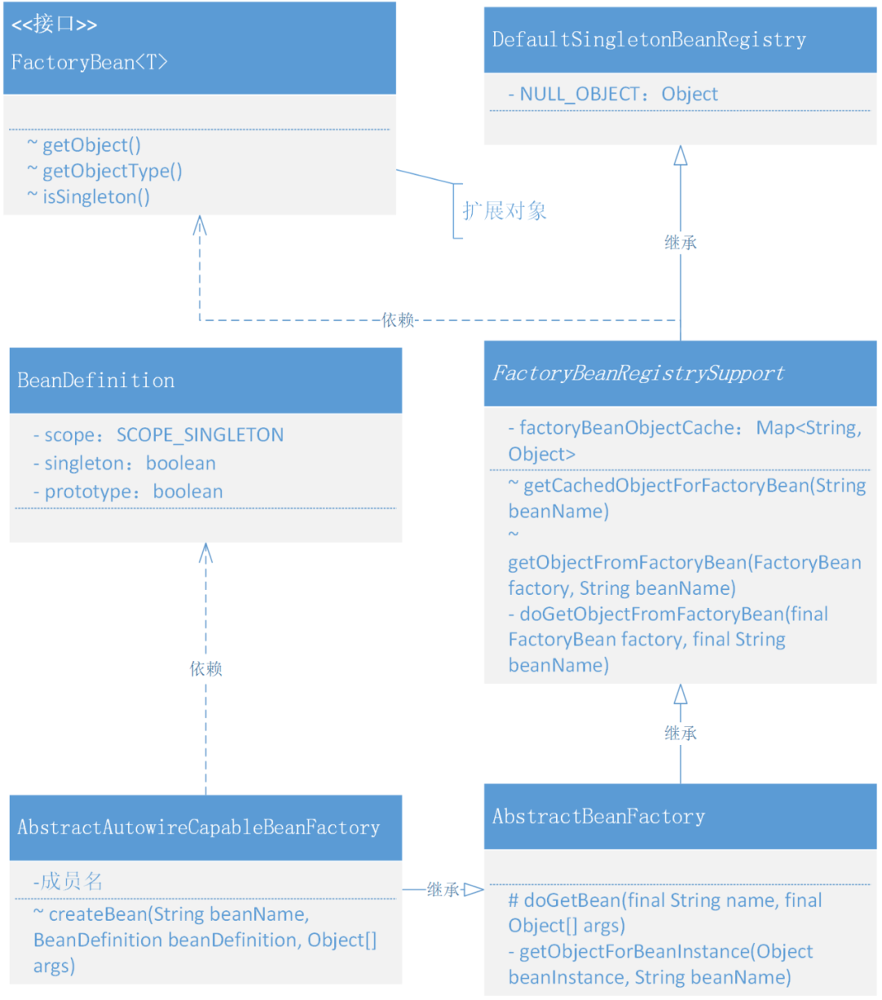

## 10. 实现事件发布订阅机制
在实际的开发中，我们通常需要一个能解偶的能力，而事件发布订阅就是一个很好的解偶双方的能力。所以本章我们完成事件的发布订阅机制。事件发布订阅的实现需要以下 3 个要素：

1. 自定义的事件
2. 事件监听
3. 事件发布

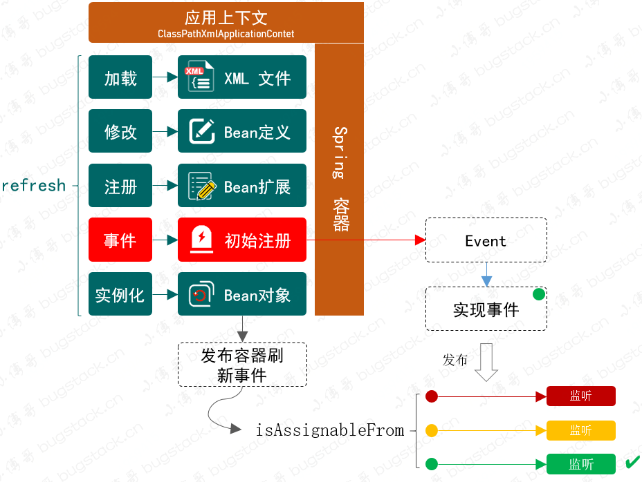

下面我们分别实现这 3 个要素。

* 首先是自定义事件。我们定义继承标准的事件类 *EventObject* 的子类 *ApplicationEvent*，然后基于这个类再定义 *ApplicationContextEvent*，后续所有的自定义事件类都基于这个类
* 然后我们定义两个继承上面的 *ApplicationContextEvent* 的的事件类：*ContextClosedEvent* 和 *ContextRefreshedEvent*，分别在容器关闭和刷新的时候触发事件
* 接着我们定义事件监听接口 *ApplicationListener*，其中的方法 onApplicationEvent 就是事件发布后的调用方法
* 上述实现了自定义的事件，接下来我们实现事件监听的功能。为此我们先定义标准接口 *ApplicationEventMulticaster*，其中包含了监听事件的添加、删除，同时还包含了事件的发布，也就是事件的订阅和发布都在这一个接口中定义了
* 然后我们定义一个抽象类 *AbstractApplicationEventMulticaster*，去实现上述的接口，并且实现了监听事件的添加、删除功能这两个基本功能，方便后续其他实现类直接使用。同时在这个类中还增加了一个获取指定事件的所有监听队列。这一功能的核心实现是基于 isAssignableFrom 来判断当前监听的事件是否是目标事件实现的
* 接着我们就可以定义一个实现类 *SimpleApplicationEventMulticaster*，它继承上述的抽象类，并且实现了 multicastEvent 广播方法，这样这个类就实现了事件的监听以及广播的能力
* 然后我们定义标准接口 *ApplicationEventPublisher*，用来定义事件发布的方法。并且在接口 *ApplicationContext* 中继承它
* 最后我们就在上下文类 *AbstractApplicationContext* 添加 *SimpleApplicationEventMulticaster* 的属性，实现事件的监听，同时实现接口 *ApplicationEventPublisher* 中的发布方法，完成事件的发布
* 以上就是事件的订阅和发布机制的全部实现

类关系如下：

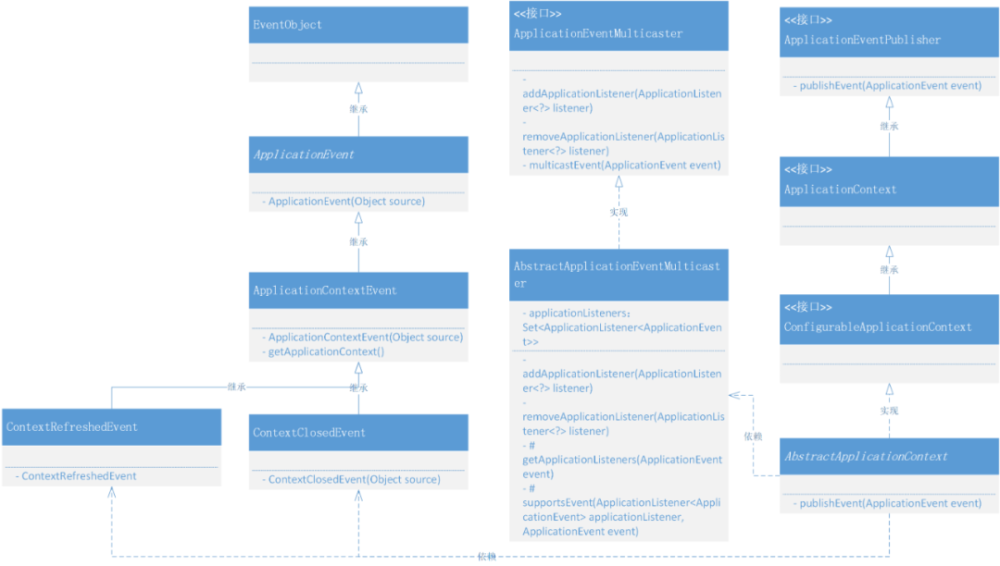

## 11. AOP 功能的实现

在日常的开发中，我们经常遇到一些场景，比如给所有方法的调用都添加一个日志，这种给一类方法统一做处理的方式通常我们都是通过 AOP 实现，也就是面向切面编程。在 Spring 框架中也提供了 AOP 能力，所以在这一章中我们来自己实现一个 AOP 的功能

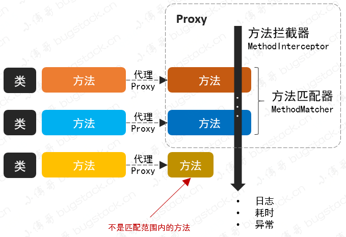

通过上述的说明我们知道 AOP 的本质其实就是能对某一类方法进行代理。其实在之前的章节中我们有代理过类，现在我们需要的是代理方法

* 其实方法的代理也不难，首先它也是通过 Proxy.newProxyInstance 这个 API 来实现的，和代理类一样，只不过要先指定一个目标对象
* 其次方法代理的一个核心点就是方法的表达。也就是我们怎么定义那些需要被代理的方法
* 有了方法的表达方式后，接下里我们就需要一个方法的判断，在我们循环遍历所有的方法时，需要判断当前方法是否是需要被代理的方法
* 当判断当前方法是我们需要的被代理方法的时候，我们需要有一个方法拦截器来实现方法的拦截
* 最后就是被拦截的方法的调用

### 实现过程
* 首先我们定义切点，也就是标准接口 *Pointcut* 用来定义过滤类和方法匹配这两个方法
* 然后我们定义匹配类和方法匹配接口：*ClassFilter* 和 *MethodMatcher*，用于给切点找到匹配的类和方法
* 接着我们就可以实现切点，我们定义一个类 *AspectJExpressionPointcut* 用来实现上述的三个接口。这里我们通过工具包 "org.aspectj.weaver.tools" 来实现核心的方法表达、类匹配、方法匹配、解析等功能
* 接着我们定义一个包装类 *AdvisedSupport*，包装了代理对象、方法拦截器和方法匹配，方便后续调用
* 接着我们实现代理对象。代理对象的核心作用就是为了实现对用户自定义的方法拦截的调用，它借助于上面的包装类 *AdvisedSupport*，可以很方便的调用方法的匹配等操作，这样在实际调用对象方法的时候，代理对象就可以验证当前方法是否匹配，然后调用方法拦截器
  * 代理对象的实现有两种方式：Cglib 和 JDK
  * 我们先定义一个标准代理接口 *AopProxy*
  * 然后基于这个接口分别定义两种方式的代理实现类：JdkDynamicAopProxy 和 Cglib2AopProxy
  * 代理对象中依赖了上述的包装类 *AdvisedSupport*，因此可以获取到所有的信息
  * 最后基于上述的包装类实现对用户自定义拦截器的调用

上述实现过程的类关系图如下：

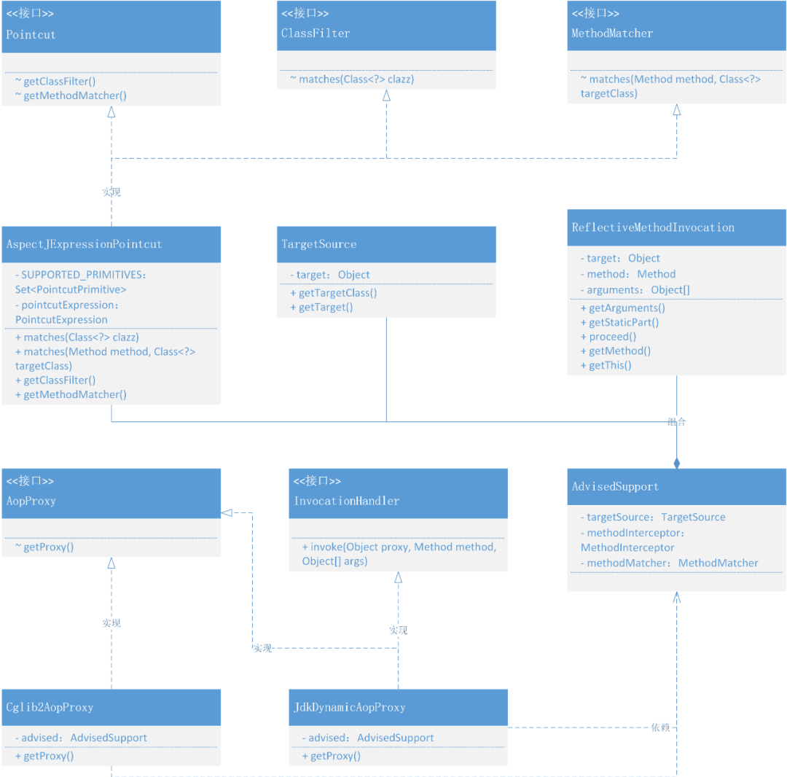

## 12. 添加 AOP 动态代理到 Bean 生命周期
上一章我们实现了 AOP 功能，这一章我们把 AOP 功能加入到我们的 Spring 框架中。添加的方式其实并不难，核心是借助 BeanPostProcessor

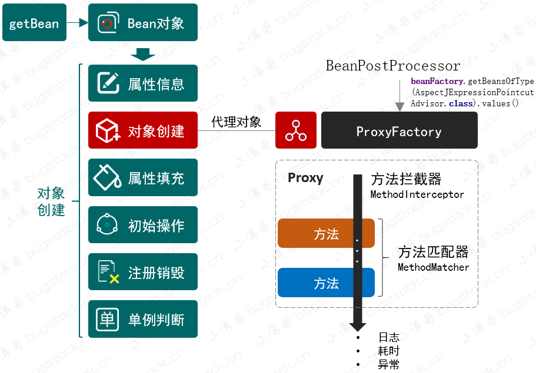

### 实现过程
* 我们首先定义拦截器链 BeforeAdvice，它扩展于接口 *Advice*。在上一章中我们并没有细分方法拦截器是在方法运行之前还是运行之后调用，但在实际的 Spring 框架中，会提供 before、after 和 around 这三种方式。所以这里我们先定义拦截器链
* 然后我们定义 *MethodBeforeAdvice*，扩展上述的接口，用来表示在方法执行前调用。当然方法执行后，环绕等都可以以同样的方式定义，这里不再赘述
* 接着我们定义访问接口 *Advisor*，用来包装上述的 *Advice*
* 再接着我们定义 *PointcutAdvisor*，扩展于上述接口 *Advisor*，它是 Point 和 Advice 的组合包装
* 接下来我们定义类 *AspectJExpressionPointcutAdvisor* 实现上述的接口。这个类中包含了切面 pointcut，拦截方法 advice 和方法表达式 expression
* 然后我们定义方法拦截器类 *MethodBeforeAdviceInterceptor*，实现 *MethodInterceptor* 接口。这个类借助于 Advice 实现拦截方法的调用。核心代码如下：
  * ```java
    @Override
    public Object invoke(MethodInvocation methodInvocation) throws Throwable {
        this.advice.before(methodInvocation.getMethod(), methodInvocation.getArguments(), methodInvocation.getThis());
        return methodInvocation.proceed();
    }
* 接着我们定义代理工厂 *ProxyFactory*，主要解决是使用 JDK 还是 Cglib 的方式代理
* 然后我们定义类 *DefaultAdvisorAutoProxyCreator*，实现接口 *InstantiationAwareBeanPostProcessor*，用来实现在 Bean 生命周期中自动创建代理者的能力，其中 *InstantiationAwareBeanPostProcessor* 是扩展自接口 *BeanPostProcessor*
* 最后我们在 createBean 方法中判断如果当前对象是 *InstantiationAwareBeanPostProcessor* 类型的话，就调用对应的方法进行初始化代理对象
* 上述就是 AOP 功能在 Spring 中的实现

上述所涉及到的类的关系如下：

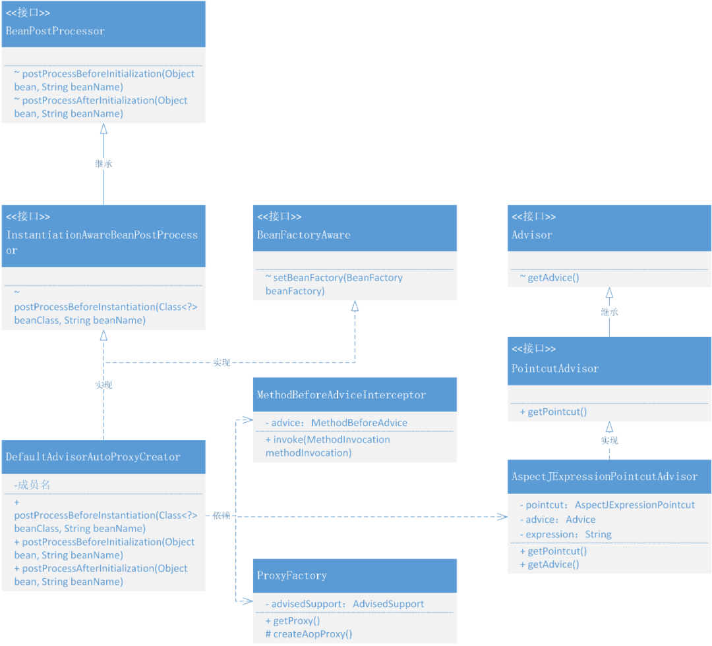

## 13. 使用注解和包扫描实现 Bean 注册
现在我们已经实现了 Spring 容器核心的 IOC 和 AOP，但现在的用法还是比较繁琐，我们要通过 XML 配置文件来定义 Bean。所以在本章我们实现包的自动扫描注册，以及属性的占位符配置

* 属性的占位符配置就是指我们可以通过 ${token} 给 Bean 对象注入进去属性信息。我们通过 BeanFactoryPostProcessor 来实现这个功能，因为它是在加载完所有 BeanDefinition 后，在对象实例化之前进行调用，刚好给我们进行属性的修改。具体很简单，就是遍历所有对象的所有属性，当监测到属性是一个占位符的时候，这时候将真正的值去替换这个占位符即可
* 包的扫描注册的实现我们需要
  * 首先是扫描路径的配置，即我们需要告诉框架在哪个路径下去扫描，我们在 xml 中通过标签 <context:component-scan /> 来表明扫描地址
  * 然后是需要有特定的标记来表示当前需要被扫描注册的对象，这个我们通过注解 @Component 来实现
  * 最后就需要一个专门的类来实现扫描注册的功能，并且在 XmlBeanDefinitionReader 中去调用这个扫描注册功能

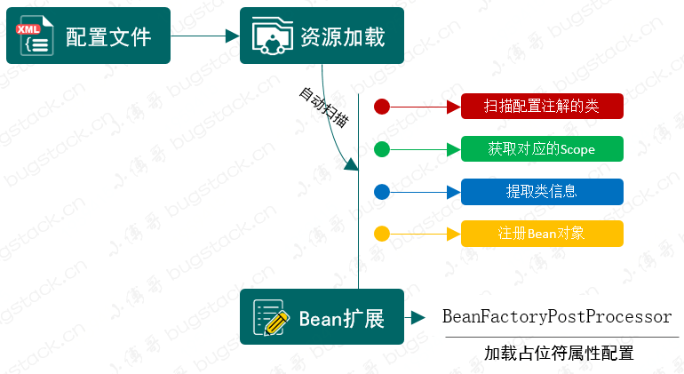

### 具体实现过程如下：
* 首先我们定义一个实现接口 *BeanFactoryPostProcessor* 的类 *PropertyPlaceholderConfigurer*，它用来处理属性占位符。方式也很简单，就是遍历当前所有的 BeanDefinition 对象的所有的属性，监测到有占位符的，则用实际值进行替换即可
* 然后我们定义两个注解 @Scope 和 @Component，前者表示作用域，一般默认 "singleton"，后者用来表示当前类需要被扫描注册
* 接下来我们定义类 *ClassPathScanningCandidateComponentProvider*，来实现在给定包路径下，找出所有需要被扫描注册的类，也就是所有被 @Component 注解的类。它的实现核心是借助于 hutool 工具包中的 scanPackageByAnnotation 方法，来获取所有指定注解的类
* 然后我们定义一个继承上述类的子类 *ClassPathBeanDefinitionScanner*，它借助父类的扫描能力，在此基础上完成实际的 BeanDefinition 对象的注册功能 doScan
* 最终我们在类 *XmlBeanDefinitionReader* 中调用上述类的扫描注册方法 doScan，完成扫描注册

上述涉及到的类关系如下：

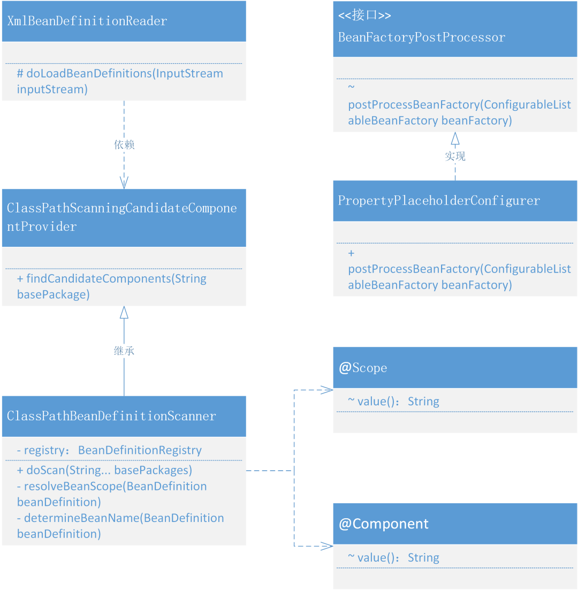

## 14. 实现属性的注入
上一章中我们完成了对象的自动扫描注册，在这一章中我们实现对象属性的自动注入，就像 @Autowired 和 @Value 注解那样，完成对象属性的自动注册。

完成属性的自动注入需要以下两件事情：
1. 将属性信息添加到 PropertyValues 的集合中
2. 创建对象后，将属性填充进去

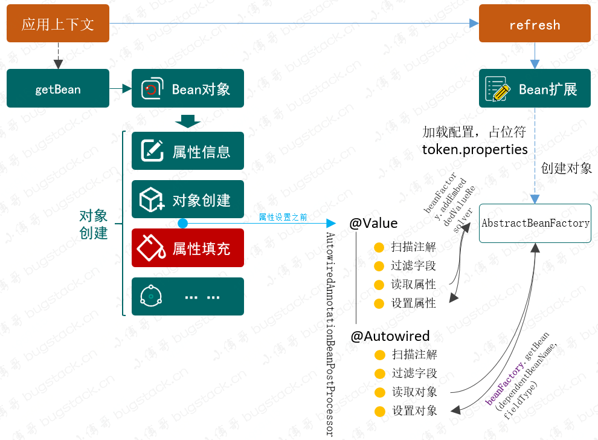

类关系如下：
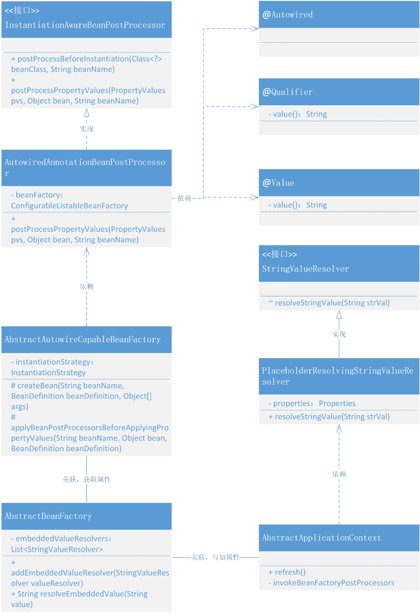
