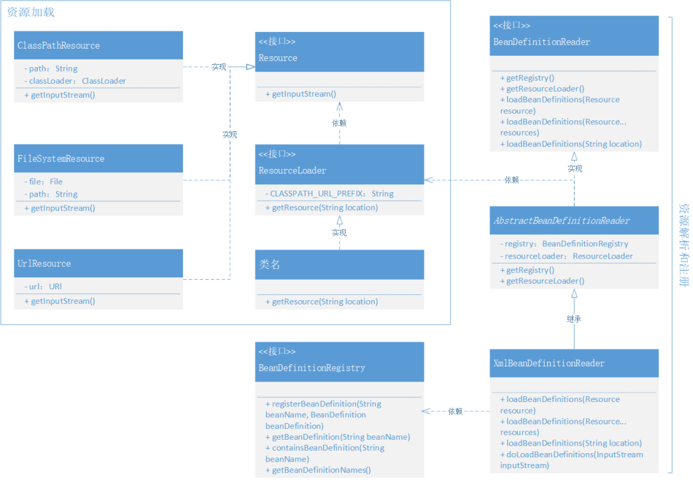

# 手写 Spring 框架

本项目是根据教程 [Spring 手撸专栏](https://mp.weixin.qq.com/s?__biz=MzIxMDAwMDAxMw==&mid=2650730541&idx=1&sn=9fcd5baf6ec3e880786c4a0384166bdd&chksm=8f6111cfb81698d9bb5a4c61075d87658f7296bdb42ea72dd1b7d4312f3b75f719399ed2223c&cur_album_id=1871634116341743621&scene=189#wechat_redirect) 自己手动实践一遍，旨在加深对教程的理解

## 1. Bean 容器

相信用过 Spring 框架开发的小伙伴都知道 IOC，DI 等这些概念，而这些概念都离不开容器。所谓的容器本质就是能保存数据的地方。本章就从容器的实现开始

上文说到容器本质就是存放并管理数据的地方，而为了能更好的实现，我们首先需要一个对数据的统一定义，方便后续的操作，然后就需要一个管理数据的接口，方便数据的添加和获取，很明显，HashMap 就很好的满足这个要求。为此我们添加下面两个对象来实现数据的定义和管理：

* BeanDefinition：用来定义对象。这里使用 BeanDefinition 将对象再包装一层，方便后续的统一操作
* BeanFactory：管理对象。内部使用 HashMap 来管理添加和获取对象

## 2. 完善 Bean 容器
在上一章我们完成了一个基本的 Bean 管理容器，现在我们需要进一步优化

* 首先就是对象的实例化操作应该由容器来实现，而不是在注册的时候手动实例化对象。所以需要改造 *BeanDefinition*，用来存储 Class，而不是实例化的对象
* 其次，我们需要扩展容器的能力，比如添加单例能力，这样在多次获取对象的时候，不至于重复创建对象，浪费性能。为了实现单例能力，我们定义了标准接口 *SingletonBeanRegistry*，以及它的实现类 *DefaultSingletonBeanRegistry*
* 然后我们定义了一个标准的接口 *BeanFactory* 用来定义 Bean 操作的核心标准
* 再然后我们添加一个抽象类 *AbstractBeanFactory* 实现了这个标准接口 *BeanFactory*，同时该类继承了上述的单例实现类 *DefaultSingletonBeanRegistry*，并最终用单例的方式实现了 getBean 方法。同时 getBean 方法的实现又依赖于 getBeanDefinition 和 createBean 这两个方法，等待后续子类继承实现
* 接着我们再定义 *AbstractAutowireCapableBeanFactory* 类并继承自上述的 *AbstractBeanFactory*，该类专门实现 createBean 的方法，通过类的 newInstance 方式来创建实例对象。不过该方法存在一些问题，下面章节会重点优化 
* 最后我们定义了最终的核心实现类 *DefaultListableBeanFactory*，它继承自上述的 *AbstractAutowireCapableBeanFactory* 类，同时为了管理 BeanDefinition，又实现了接口 *BeanDefinitionRegistry*，最终实现了 getBeanDefinition 方法

我们通过上述的接口定义、类继承等方式，实现了单例能力，并且通过清晰的指责划分，将 bean 的获取、创建、注册等严格区分开，方便后续管理和扩展

整体的设计如下：

容器中的各个类关系如下：

## 3. 对象实例化的优化
在上一章中，我们对对象的实例化只做了简单的处理，只能满足无参情况的实例化。这一章中补上有参的实例化功能。目前我们有以下两种方式进行对象的实例化：

1. JDK 方式：基于反射技术，是 Java 自带的
2. Cglib 方式：基于字节码技术，并且在实例化的时候是创建一个目标对象的子对象来实现的

为了方便这两种实例化方式的管理，这里我们使用策略模式来实现。首先定义一个标准的实例化策略接口 *InstantiationStrategy*，其中包含 instantiate 方法

然后基于这个标准接口，我们添加了两个基本的实例化实现类：*SimpleInstantiationStrategy*, *CglibSubclassingInstantiationStrategy*，分别代表 JDK 方式实例化对象和 Cglib 方式实例化对象

同时我们在 BeanFactory 接口中增加了一个带构造参数的 getBean 方法，并修改类 *AbstractAutowireCapableBeanFactory* 类中的 createBean 中的实现方法，根据参数数量来获取对应的构造函数后，再调用前面的实例化方式进行创建对象

整体结构如下：

对象修改如下：

## 4. 对象属性填充
我们现在已经完成了对象实例化的创建，但一个对象内部还有很多的属性，因此这一章我们来实现对象属性的添加。

* 首先对象属性的添加时机肯定是在对象创建完成后，所以我们在类 *AbstractAutowireCapableBeanFactory* 的 createBean 方法中，在实例化对象后，添加方法 applyPropertyValues 来给对象进步一添加属性
* 其次就是属性的表达，我们这里定义类 *PropertyValue* 用来表示属性，它包含 name 和 value 这两个值
* 一般对象都会有多个属性，所以我们又定义类 *PropertyValues*，用来管理属性，包含添加、获取属性列表、获取指定属性等方法，用来管理我们的属性
* 同时，对象的属性不仅包含 int, boolean 等基础数据，也包含 Object，Bean 等其他对象，而为了表示其他 Bean 对象（对象 A 里面包含了对象 B），我们这里使用类 *BeanReference* 来表示其他对象属性
* 然后我们修改 BeanDefinition，添加 propertyValues 属性来表示 Bean 中的所有属性
* 最后在添加对象属性的时候，我们使用 hutool-all 工具中的 BeanUtil 来添加属性值。对于 BeanReference 类型的属性添加，我们需要先去获取 Bean，然后在添加，对于其他类型的属性，则可以直接添加
* 对象之间的循环依赖问题这里暂不处理

## 5. 实现从 XML 加载 Bean 对象
上一章我们已经实现了对象属性的添加，现在还有一个问题就是对象的注册，属性的添加等都是我们手动操作的，所以这章节我们实现从配置文件中自动注册加载 Bean 对象。加载过程如下：从不同类型的资源中解析并注册添加 Bean 对象到容器中

为了实现上述的能力，我们需要实现下述内容：

* 首先我们需要定义一个表示资源的接口 *Resource*，其中的 getInputStream 方法就是输出资源内容的接口
* 接下来我们就可以基于这个标准接口定义三个类: *ClassPathResource*, *FileSystemResource*, *UrlResource* 分表表示类路径、文件和 url 这 3 种资源
* 现在我们有了上述的用来表示资源的类以后，接下来我们需要实现一个资源加载的类，用来统一包装实现上述这 3 个不同资源的加载。为此我们定义标准接口 *ResourceLoader*，以及其实现类: *DefaultResourceLoader*，资源统一加载的实现逻辑如下：
  * 先判断路径是否是 "classpath:" 前缀的，如果是，则直接返回 ClassPathResource 资源
  * 如果不是"classpath:" 前缀，则尝试 URL 连接并返回 UrlResource 资源
  * 如果上述步骤报错，则返回最后一种 FileSystemResource 资源
* 在实现了上述的资源加载类以后，接下来就是资源的解析、Bean 对象注册添加的实现了。为此我们还是先定义标准接口 *BeanDefinitionReader*，其核心方法是 loadBeanDefinitions，但该方法的实现也同时依赖于另外两个非核心方法: getRegistry 和 getResourceLoader
* 我们定义一个抽象类 *AbstractBeanDefinitionReader* 用来实现上述接口的非核心方法
* 然后我们就可以定义核心实现类 *XmlBeanDefinitionReader*，实现其核心方法 loadBeanDefinitions，实现逻辑如下：
  * 以 XML 的形式去解析资源，并循环遍历其中的节点
  * 找出其中以 bean 为命名的节点，解析标签，获取各种属性后，生成 BeanDefinition 对象
  * 继续遍历上述节点的子节点，找出其属性节点后进行属性的添加
  * 最后完成 BeanDefinition 的注册，需要注意对重复注册的判断
* 最后，我们需要将上述的 BeanDefinitionReader 和 BeanFactory 两者关联起来就可以了。这里我们是通过将 DefaultListableBeanFactory 作为 BeanDefinitionReader 的一个属性来进行关联  
  
在上述的资源解析实现过程中，我们先定义了标准接口，然后定义了一个抽象类用来实现标准接口中的非核心方法，最后再定义核心实现类用来实现核心逻辑，这种接口管定义，抽象类管其他实现，最终实现类管核心实现逻辑的设计方式是我们日常用到的，可以有效的避免无关方法污染最终实现类

以上这些接口、类的关系如下：

## 6. 实现上下文和扩展机制
在上一章的实现中，我们通过 BeanFactory 和 BeanDefinitionReader 来实现 Bean 的创建和注册，但这种方式使用起来比较繁琐，不适合面向用户。因此在这章中我们通过实现一个上下文类来结合这两者，对外提供一个完整的服务

同时我们还提供了扩展机制，如下：
* BeanFactoryPostProcessor：是由 Spring 框架组建提供的容器扩展机制，允许在 Bean 对象注册后但未实例化之前，对 Bean 的定义信息 BeanDefinition 执行修改操作。
* BeanPostProcessor：也是 Spring 提供的扩展机制，不过 BeanPostProcessor 是在 Bean 对象实例化之后修改 Bean 对象，也可以替换 Bean 对象。这部分与后面要实现的 AOP 有着密切的关系。

整体的结构设计如下：在应用上下文类中通过 refresh 方法自动实现 Bean 加载、注册和实例化；同时在 createBean 的前后提供钩子函数，方便修改 Bean 对象

### BeanFactory 相关接口的改动
在具体开始前，我们先对原先的一些接口做改动和扩充，具体如下：
* BeanFactory: 已经存在的 Bean 工厂接口用于获取 Bean 对象，这次新增加了按照类型获取 Bean 的方法：<T> T getBean(String name, Class<T> requiredType)
* ListableBeanFactory: 是一个扩展 Bean 工厂接口的接口，新增加了 getBeansOfType、getBeanDefinitionNames() 方法，在 Spring 源码中还有其他扩展方法
* HierarchicalBeanFactory: 在 Spring 源码中它提供了可以获取父类 BeanFactory 方法，属于是一种扩展工厂的层次子接口
* AutowireCapableBeanFactory: 是一个自动化处理 Bean 工厂配置的接口
* ConfigurableBeanFactory: 可获取 BeanPostProcessor、BeanClassLoader等的一个配置化接口。
* ConfigurableListableBeanFactory: 提供分析和修改Bean以及预先实例化的操作接口，不过目前只有一个 getBeanDefinition 方法。

### 应用上下文类的实现
* 首先我们定义一个最基本的上下文类接口 *ApplicationContext*，它继承自 *ListableBeanFactory*，意味着这个上下文接口就有用了 BeanFactory 的能力
* 然后我们在上面的 *ApplicationContext* 的基础上定义接口 *ConfigurableApplicationContext*，用来定义刷新容器方法 refresh
* 接着我们定义抽象实现类 *AbstractApplicationContext*，它继承了 DefaultResourceLoader 类，拥有了资源加载能力，同时它还实现上述接口中的 refresh 方法，实现逻辑主要包含以下几步：
  * 创建 BeanFactory，并加载 BeanDefinition
  * 获取 BeanFactory
  * 执行 BeanFactory 创建后的钩子函数 BeanFactoryPostProcessor
  * 注册 Bean 对象实例化前后的钩子函数 BeanPostProcessor，方便后续 Bean 实例化时调用
  * 提前实例化单例Bean对象
* 接着我们定义抽象实现类 *AbstractRefreshableApplicationContext*，用来实现 BeanFactory 的创建和加载方法，这里主要是将抽象类 *DefaultListableBeanFactory* 作为内部属性来实现
* 然后我们定义抽象实现类 *AbstractXmlApplicationContext*，用来实现 BeanDefinition 的加载
* 最后我们定义最终的上下文实现类 *ClassPathXmlApplicationContext*

### 扩展机制的实现
* 我们定义接口 *BeanFactoryPostProcessor* 用来表示 BeanFactory 创建后的扩展，定义接口 *BeanPostProcessor* 来表示 Bean 实例化前后的钩子函数
* BeanFactoryPostProcessor 钩子函数在上述 refresh 中就已经调用了，具体的调用方式很简单，就是直接获取该类型的对象，然后直接调用方法即可
* BeanPostProcessor 在 refresh 函数中会先进行添加，添加的逻辑实现在 AbstractBeanFactory 类中，然后再后续 Bean 对象实例化时再进行调用
* 我们定义接口 *AutowireCapableBeanFactory*，用来定义 Bean 实例化前后的两个钩子方法
* 我们定义接口 *ConfigurableBeanFactory*，用来定义添加钩子函数的方法，并且在抽象类 *AbstractBeanFactory* 中实现添加钩子函数的方法
* 最后我们定义抽象类 *AbstractAutowireCapableBeanFactory*，该抽象类继承 *AbstractBeanFactory*，所以拥有了钩子函数的添加能力，然后也实现了接口 *AutowireCapableBeanFactory*，实现了钩子函数的调用方法，该钩子函数的调用方法也很简单，就是就是直接循环调用注册那些钩子函数即可，而具体的钩子函数的注册在 refresh 中就已经完成

至此我们就完成了扩展机制的实现，这里再简单总结一下:

* 对于 BeanFactoryPostProcessor 钩子函数，我们直接在 refresh 中调用实现，对于 BeanPostProcessor 钩子函数，我们先在 refresh 中注册添加，然后在 *AbstractAutowireCapableBeanFactory* 抽象类中，在实例化 Bean 的时候进行调用
* 同时为了设计实现，我们将钩子的注册添加通过接口 *ConfigurableBeanFactory* 来定义，并由抽象类 *AbstractBeanFactory* 实现
* 钩子函数的调用实现通过接口 *AutowireCapableBeanFactory* 来定义
* 最后抽象类 *AbstractAutowireCapableBeanFactory* 继承 *AbstractBeanFactory*，并且实现 *AutowireCapableBeanFactory* 接口，完成钩子的注册添加以及实现调用的完整流程

## 7. Bean 对象创建和销毁的钩子
这里我们使用两种方式来实现对象创建和销毁的钩子：
1. 通过接口定义的方式来实现：提供了 InitializingBean 和 DisposableBean 这两个接口来定义对象的创建和销毁的钩子函数，在对应的生命周期中，通过判断当前 bean 对象是否实现了这两个接口来实现调用（直接使用 instanceof 来进行判断, 并强制转换后直接调用）
2. 通过 xml 中配置来实现：在 BeanDefinition 中增加 init-method 和 destroy-method 属性来定义对象的创建和销毁的钩子函数，并通过反射的方式进行调用
3. 添加了 DisposableBeanAdapter 类来统一两种形式的销毁钩子

类关系图如下：

## 8. 定义标记类对象，实现容器感知
我们不仅可以通过创建、销毁等钩子函数来感知容器，还可以通过标记类的方式来感知容器，具体实现也比较简单，通过定义一个标记接口 Aware，然后在 Bean 对象创建的过程中通过 instanceof 来判断当前的 Bean 对象是否实现了 Aware 接口，再调用相关的代码。

我们定义如下 4 个 Aware 接口来感知容器中不同的对象：
* BeanFactoryAware：感知所属的 BeanFactory 
* BeanClassLoaderAware：感知所属的 ClassLoader
* BeanNameAware：感知所属的 BeanName
* ApplicationContextAware：感知所属的 ApplicationContext

**注意**：由于 ApplicationContext 的获取并不能直接在创建 Bean 时候就可以拿到，所以需要在 refresh 操作时，把 ApplicationContext 写入到一个包装的 BeanPostProcessor 中去，再由 AbstractAutowireCapableBeanFactory.applyBeanPostProcessorsBeforeInitialization 方法调用。

类关系如下：

## 9. Bean 对象作用域的实现已经动态代理对象的注册
之前创建的 Bean 对象默认都是单例的，即只会创建一次，后续直接从缓存中获取，本节中我们添加原型作用域，在每次使用的时候都会重新创建对象。 同时还增加了代理对象注册到容器中的能力。

我们在使用 Spring、MyBatis 框架的时候都可以知道，并没有手动的去创建任何操作数据库的 Bean 对象，有的仅仅是一个接口定义，而这个接口定义竟然可以被注入到其他需要使用 Dao 的属性中去了，那么这一过程最核心待解决的问题，就是需要完成把复杂且以代理方式动态变化的对象，注册到 Spring 容器中。

* 关于作用域的实现，其本质就是 BeanDefinition 中添加 scope 属性，然后在 createBean 的时候，根据 scope 来决定是否放到内存中
* 代理对象的注册是通过 FactoryBean 接口来实现的。通过接口中的 getObject 来获取到当前的代理对象。

## 10. 实现事件发布订阅机制
事件的发布订阅通常用来在一对多的场景下进行消息的通信，可以更好的解耦。事件机制主要有以下 3 个接口完成：
* 事件定义: ApplicationEvent
* 事件监听: ApplicationEventMulticaster，定义了提供添加、删除、广播事件的功能
* 事件发布: ApplicationEventPublisher，定了事件发布标准
* 事件监听函数: ApplicationListener。对当前事件是否感兴趣的分析是通过 isAssignableFrom 来进行判断的。isAssignableFrom 和 instanceof 相似，不过 isAssignableFrom 是用来判断子类和父类的关系的，或者接口的实现类和接口的关系的，默认所有的类的终极父类都是Object。如果 A.isAssignableFrom(B) 结果是 true，证明 B 可以转换成为 A,也就是 A 可以由 B 转换而来。

事件监听函数的添加是在 refresh 函数中实现

类关系如下：

## 11. 基于 JDK 和 Cglib 的动态代理实现 AOP
代理的实现有两个关键点：
1. 如何对指定的方法进行代理，之前我们都是直接代理的整个类，而不是某些方法
2. 如何把类的职责拆分出来

类关系图：

* 整个类关系图就是 AOP 实现核心逻辑的地方，上面部分是关于方法的匹配实现，下面从 AopProxy 开始是关于方法的代理操作。
* AspectJExpressionPointcut 的核心功能主要依赖于 aspectj 组件并处理 Pointcut、ClassFilter,、MethodMatcher 接口实现，专门用于处理类和方法的匹配过滤操作。
* AopProxy 是代理的抽象对象，它的实现主要是基于 JDK 的代理和 Cglib 代理。在前面章节关于对象的实例化 CglibSubclassingInstantiationStrategy，我们也使用过 Cglib 提供的功能。

## 12. 添加 AOP 动态代理到 Bean 生命周期
其实在有了AOP的核心功能实现后，把这部分功能服务融入到 Spring 其实也不难，只不过要解决几个问题，包括：怎么借着 BeanPostProcessor 把动态代理融入到 Bean 的生命周期中，以及如何组装各项切点、拦截、前置的功能和适配对应的代理器。整体设计结构如下图：

类关系如下：

* 整个类关系图中可以看到，在以 BeanPostProcessor 接口实现继承的 InstantiationAwareBeanPostProcessor 接口后，做了一个自动代理创建的类 DefaultAdvisorAutoProxyCreator，这个类的就是用于处理整个 AOP 代理融入到 Bean 生命周期中的核心类。
* DefaultAdvisorAutoProxyCreator 会依赖于拦截器、代理工厂和Pointcut与Advisor的包装服务 AspectJExpressionPointcutAdvisor，由它提供切面、拦截方法和表达式。
* Spring 的 AOP 把 Advice 细化了 BeforeAdvice、AfterAdvice、AfterReturningAdvice、ThrowsAdvice，目前我们做的测试案例中只用到了 BeforeAdvice，这部分可以对照 Spring 的源码进行补充测试。

## 13. 使用注解和包扫描实现 Bean 注册
为了实现自动扫描注册，我们需要完成两件事：
1. 提供需要扫描的基本包的路径
2. 对需要自动注册的 Bean 对象添加注解来进行标记

同时通过 BeanFactoryPostProcessor 接口来实现对生成后的 Bean 对象进行属性占位符的替换。

类关系如下：

## 14. 实现属性的注入
在上一节我们通过 Component 注解实现了对象的自动注册，现在我们实现对象属性的自动注入，就像 @Autowired 和 @Value 注解那样，完成对象属性的自动注册。

完成属性的自动注入需要以下两件事情：
1. 将属性信息添加到 PropertyValues 的集合中
2. 创建对象后，将属性填充进去

类关系如下：

